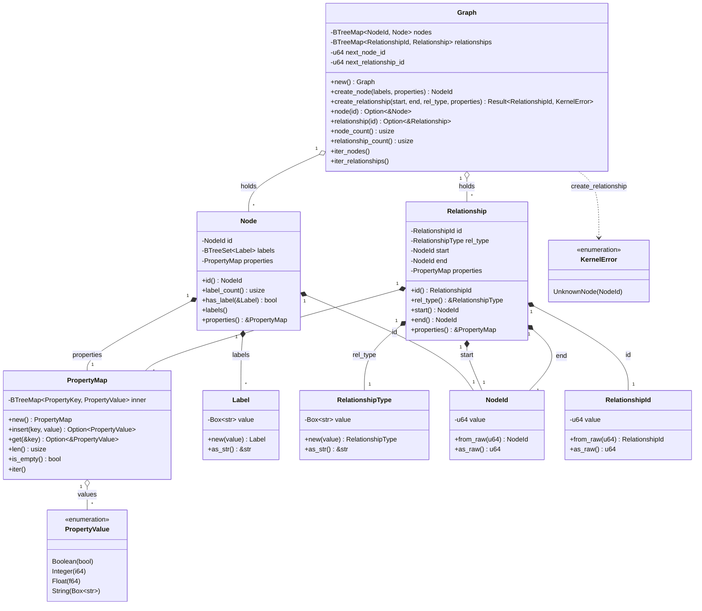
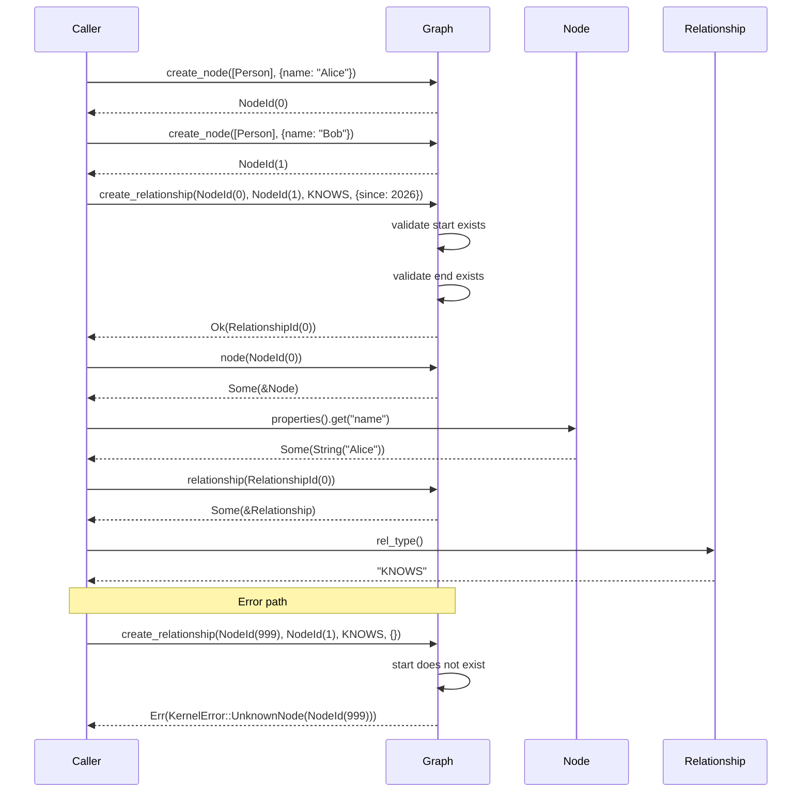

# Data model — labeled property graph (`APH-DM-001`)

This note documents the kernel data-model module that satisfies the
requirement *"The system shall implement a labeled property graph data
model."* It is the human-reviewer companion to the
`crates/capcom/src/data_model/` source tree and to the architecture
preflight at [`../APH-DM-001-preflight.md`](../APH-DM-001-preflight.md).

## Scope

In scope (this requirement only):

- A type vocabulary that defines the labeled property graph (LPG):
  nodes, relationships, labels, relationship types, properties.
- An in-memory `Graph` container with id allocation, lookup, and
  iteration.
- Internal kernel error handling (`KernelError`) for graph operations
  that can fail.

Out of scope (sibling requirements, kept DRAFT):

- Persistence and durability (`APH-STO-*`)
- Transactions (`APH-TXN-*`)
- The full scalar matrix — DATE, ZONED TIME, POINT, VECTOR, etc.
  (`APH-DM-010`, `APH-DM-019`–`023`)
- Property-list semantics (`APH-DM-011`–`013`)
- Null and three-valued logic (`APH-DM-014`–`016`)
- Path values (`APH-DM-017`/`018`)
- Schema introspection (`APH-DM-024`–`026`)
- Query language and openCypher surface

The preflight is explicit that `APH-DM-001` must establish the LPG
boundary without preempting these sibling concerns. This document and
the underlying source observe that line.

## Public API surface

The kernel's public API surface is unchanged: `capcom::version()` is
the only `pub` item. Every type defined here is `pub(crate)`.

The architecture-test gate at
`crates/capcom-arch-tests/tests/kernel_boundary.rs` enforces this; the
public surface only grows when a follow-up requirement adds an
operation that the product/kernel boundary actually needs to call. See
the preflight section "Guardrails" for the rationale.

## Type vocabulary

| Type | Module | Purpose |
| --- | --- | --- |
| `NodeId` | `data_model::ids` | Internal node identifier (newtype over `u64`) |
| `RelationshipId` | `data_model::ids` | Internal relationship identifier (newtype over `u64`) |
| `Label` | `data_model::labels` | Non-empty label string attached to a node |
| `RelationshipType` | `data_model::labels` | Non-empty type string carried by a relationship |
| `PropertyKey` | `data_model::properties` | Non-empty property name |
| `PropertyValue` | `data_model::properties` | Scalar value (`Boolean`, `Integer`, `Float`, `String`); `#[non_exhaustive]` |
| `PropertyMap` | `data_model::properties` | Ordered map of `PropertyKey → PropertyValue` |
| `Node` | `data_model::node` | Node value with labels and properties |
| `Relationship` | `data_model::relationship` | Directed, typed relationship between two `NodeId`s |
| `Graph` | `data_model::graph` | In-memory container with id allocation |
| `KernelError` | `error` | Kernel-wide error enum (single owner per preflight) |

### Class diagram

### Sequence diagram — typical usage

## Design decisions

These are *implementation* decisions, not architecture decisions
warranting an ADR (the preflight is explicit that no new ADR is
warranted unless implementation exposes a conflict).

### Newtype identifiers over `u64`

`NodeId` and `RelationshipId` wrap `u64`. Call sites that today depend
on the integer representation get a single chokepoint to update when
external identity (`APH-DM-025`) and stable cross-restart identity
(`APH-STO-014`) land. Bare `u64` would force a workspace-wide audit at
that point.

Internal ids carry no durability or addressing semantics. They are
valid only within a single `Graph` instance. The preflight is explicit
that storage page slots and external durable identity must not collapse
into this type.

### `BTreeMap`-backed `PropertyMap`

The kernel needs deterministic iteration order for tests, snapshotting,
and any future content-hashing of node or relationship state. `HashMap`
would make all of those flaky. `BTreeMap` is in `std`, so this adds no
dependency.

### `#[non_exhaustive] PropertyValue`

Marking the enum non-exhaustive lets sibling requirement `APH-DM-010`
add the full scalar matrix (DATE, POINT, VECTOR, …) without breaking
match sites already using the existing four scalars.

### Empty-string rejection at construction

`Label::new`, `RelationshipType::new`, and `PropertyKey::new` panic on
empty input. Storage and query layers further down can then assume
non-empty content. Construction-time panics are deliberate over
constructors that return `Result` here: these are kernel-internal
invariants, not validation of untrusted input — that lives at the
product/kernel boundary or at parser boundaries that don't exist yet.

### Single `KernelError` enum

Per the preflight: *"Introduce kernel error handling once and reuse it
consistently. Do not create separate invariant-failure hierarchies in
model, storage, engine host, and future adapters."* `KernelError` lives
at `crates/capcom/src/error.rs` and starts with one variant
(`UnknownNode`). New variants land here as new requirements need them.

### Direction is stored, queried later

`Relationship` stores a directed `(start, end)` pair. Whether a query
treats it as directed or undirected is `APH-DM-006`'s job and lives at
the query-time boundary, not in this module.

## Tests

Every `data_model` submodule has unit tests in a `#[cfg(test)] mod
tests` block. The full LPG-semantics tests live in
`crates/capcom/src/data_model/graph.rs::tests` so they can stay inside
the crate (the data-model types are `pub(crate)`, so an external
integration test would not be able to reach them). The tests map to
the requirement statement clause-by-clause:

- `nodes_can_carry_zero_or_more_labels` — labeled node semantics.
- `relationships_are_typed_directed_and_link_existing_nodes` — typed,
  directed, validated endpoints.
- `nodes_and_relationships_both_carry_property_maps` — property maps on
  both sides.
- `graph_can_hold_many_entities_and_look_them_up_by_id` — container
  identity round-trip.
- `create_relationship_rejects_unknown_start_node` and
  `create_relationship_rejects_unknown_end_node` — `KernelError`
  surface.
- `ids_are_monotonic_within_a_graph` — id allocator.

Run with `cargo test --workspace --all-targets`.

## Verification checklist

- `cargo build --workspace --all-targets`
- `cargo clippy --workspace --all-targets -- -D warnings`
- `cargo test --workspace --all-targets`
- `scripts/check-adr-conformance.sh`
- `crates/capcom-arch-tests/tests/kernel_boundary.rs::kernel_public_api_surface_is_minimal`
  — still passes without modification, confirming the public surface
  is still just `version()`.
